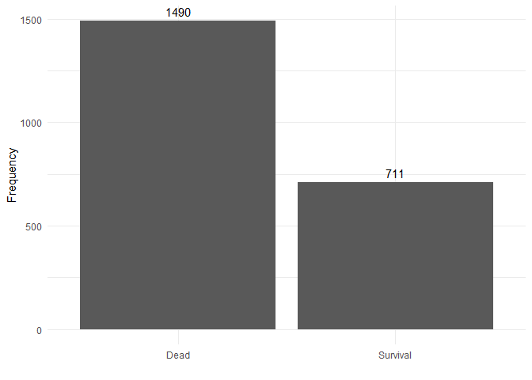

Week3
================
Xu Han
2023-07-23

\#Install and import the necessary packages

``` r
packages = c("ggplot2","dplyr","psych")
#check for missing packages; load and install as needed.
package.check <- lapply(packages, FUN = function(x){
    if (!require(x, character.only = TRUE)) {
        install.packages(x, dependencies = TRUE)
        library(x, character.only = TRUE)
    }
})
```

    ## Loading required package: ggplot2

    ## Warning: package 'ggplot2' was built under R version 4.1.3

    ## Loading required package: dplyr

    ## Warning: package 'dplyr' was built under R version 4.1.3

    ## 
    ## Attaching package: 'dplyr'

    ## The following objects are masked from 'package:stats':
    ## 
    ##     filter, lag

    ## The following objects are masked from 'package:base':
    ## 
    ##     intersect, setdiff, setequal, union

    ## Loading required package: psych

    ## 
    ## Attaching package: 'psych'

    ## The following objects are masked from 'package:ggplot2':
    ## 
    ##     %+%, alpha

\#This brings the ‘Titanic’ data into my environment from Base R (Run
this)

``` r
Titanic
```

    ## , , Age = Child, Survived = No
    ## 
    ##       Sex
    ## Class  Male Female
    ##   1st     0      0
    ##   2nd     0      0
    ##   3rd    35     17
    ##   Crew    0      0
    ## 
    ## , , Age = Adult, Survived = No
    ## 
    ##       Sex
    ## Class  Male Female
    ##   1st   118      4
    ##   2nd   154     13
    ##   3rd   387     89
    ##   Crew  670      3
    ## 
    ## , , Age = Child, Survived = Yes
    ## 
    ##       Sex
    ## Class  Male Female
    ##   1st     5      1
    ##   2nd    11     13
    ##   3rd    13     14
    ##   Crew    0      0
    ## 
    ## , , Age = Adult, Survived = Yes
    ## 
    ##       Sex
    ## Class  Male Female
    ##   1st    57    140
    ##   2nd    14     80
    ##   3rd    75     76
    ##   Crew  192     20

\#This code saves the Titanic data as a dataframe with a new name
\#TASK: Save the Titanic data as a dataframe with a new name that
includes your first name \#for example I would name my data AnnaTitanic

``` r
Xutitanic=data.frame(Titanic)
```

\#This code chunk allows me to see the top 2 rows of my data \#TASK:
Write the code that returns the top rows

``` r
head(Xutitanic,n=2)
```

    ##   Class  Sex   Age Survived Freq
    ## 1   1st Male Child       No    0
    ## 2   2nd Male Child       No    0

\#This code chunk shows me the internal structure \#Task: Write the code
that shows the number of rows, columns, column names, class of columns

``` r
str(Xutitanic)
```

    ## 'data.frame':    32 obs. of  5 variables:
    ##  $ Class   : Factor w/ 4 levels "1st","2nd","3rd",..: 1 2 3 4 1 2 3 4 1 2 ...
    ##  $ Sex     : Factor w/ 2 levels "Male","Female": 1 1 1 1 2 2 2 2 1 1 ...
    ##  $ Age     : Factor w/ 2 levels "Child","Adult": 1 1 1 1 1 1 1 1 2 2 ...
    ##  $ Survived: Factor w/ 2 levels "No","Yes": 1 1 1 1 1 1 1 1 1 1 ...
    ##  $ Freq    : num  0 0 35 0 0 0 17 0 118 154 ...

\#This code chunk shows me some basic summary stats \#Such as Min, Max,
Mean. Quartiles… \#Task: Write the code that gives summary stats

``` r
psych::describe(Xutitanic)
```

    ##           vars  n  mean     sd median trimmed   mad min max range skew kurtosis
    ## Class*       1 32  2.50   1.14    2.5    2.50  1.48   1   4     3 0.00    -1.46
    ## Sex*         2 32  1.50   0.51    1.5    1.50  0.74   1   2     1 0.00    -2.06
    ## Age*         3 32  1.50   0.51    1.5    1.50  0.74   1   2     1 0.00    -2.06
    ## Survived*    4 32  1.50   0.51    1.5    1.50  0.74   1   2     1 0.00    -2.06
    ## Freq         5 32 68.78 136.00   13.5   36.62 20.02   0 670   670 3.07     9.93
    ##              se
    ## Class*     0.20
    ## Sex*       0.09
    ## Age*       0.09
    ## Survived*  0.09
    ## Freq      24.04

\#We can also use summarize for a speicifc vairable

``` r
Xutitanic%>%
    group_by(Class,Survived)%>%
    summarize(Total=sum(Freq))
```

    ## `summarise()` has grouped output by 'Class'. You can override using the
    ## `.groups` argument.

    ## # A tibble: 8 x 3
    ## # Groups:   Class [4]
    ##   Class Survived Total
    ##   <fct> <fct>    <dbl>
    ## 1 1st   No         122
    ## 2 1st   Yes        203
    ## 3 2nd   No         167
    ## 4 2nd   Yes        118
    ## 5 3rd   No         528
    ## 6 3rd   Yes        178
    ## 7 Crew  No         673
    ## 8 Crew  Yes        212

\#This allows me to save one column as its own object (‘values’ in the
Environment) \#Task: Write the code to create an object for just the Sex
column \#and write the code to create an object for just the Age column
\#(these should show as values in the environment window, not as
‘datasets’Data’)

``` r
Age=Xutitanic$Age

Sex=Xutitanic$Sex
```

\#This takes the individual objects (‘values’ in the Environment) and
creates a dataframe \#Once I do this, I can see the Data in the
Environment \#Task: Write the code to create one new data.frame from the
Sex and Age values you just created

``` r
newdata=data.frame(factor_var1=Age,factor_var2=Sex)
```

\#This code chunk creates a subset from my dataset \#Note that the
subset only appears in the Console (not the Environment) \#Task: Write
the code to create a subset of the data where the Freq is \> 25 \#If I
wanted to save the subset, I would need to name it as done in the code
above

``` r
titanic2=Xutitanic %>% 
         filter(Freq>25)
```

\#This shows me how many rows are in my dataset and \#TASK: Write the
code that returns the number of rows

``` r
length(Xutitanic$Class)
```

    ## [1] 32

\#This shows me how many columns are in my dataset \#TASK: Write the
code that returns the number of columns

``` r
length(Xutitanic)
```

    ## [1] 5

\#This also shows me how many rows and columns with just one command
\#TASK: Write the code that returns the number of rows and columns with
just one command

``` r
dim(Xutitanic)
```

    ## [1] 32  5

\#This code will install the ggplot2 package \#TASK: Write the code that
installs the ggplot2 package

``` r
packages = c("ggplot2")
#check for missing packages; load and install as needed.
package.check <- lapply(packages, FUN = function(x){
    if (!require(x, character.only = TRUE)) {
        install.packages(x, dependencies = TRUE)
        library(x, character.only = TRUE)
    }
})
```

\#This code calls the ggplot2 package so I can use its functions \#Task:
Write the code that ‘calls’ the ggplot2 package

``` r
library(ggplot2)
```

\#This code creates a bar chart of the number of passengers that
survived \#and did not survive (2 bars) \#Task: replace the dataframe
name and column names to create the chart \#(you should see the chart in
the Plots window)

\#Get the frequency first

``` r
Freq_data=Xutitanic%>%
           group_by(Survived)%>%
           summarise(Total=sum(Freq))
Freq_data
```

    ## # A tibble: 2 x 2
    ##   Survived Total
    ##   <fct>    <dbl>
    ## 1 No        1490
    ## 2 Yes        711

\#Plot the bar chart

``` r
p <- ggplot(Freq_data, aes(x = factor(Survived), y = Total)) +
    geom_bar(stat = "identity") +
    geom_text(aes(label = Total), vjust = -0.5, position = position_dodge(width = 0.9)) +
    theme_minimal()+
    scale_x_discrete(labels = c("Dead", "Survival"))+
    labs(y="Frequency",x="")

print(p)
```

<!-- -->
