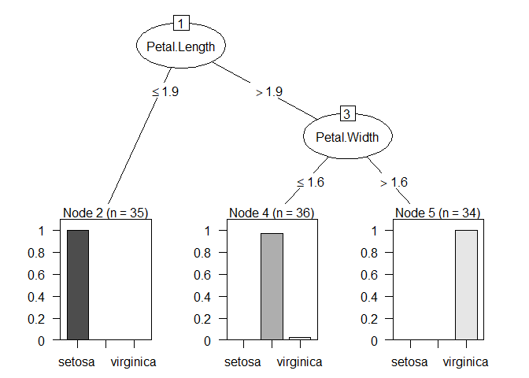
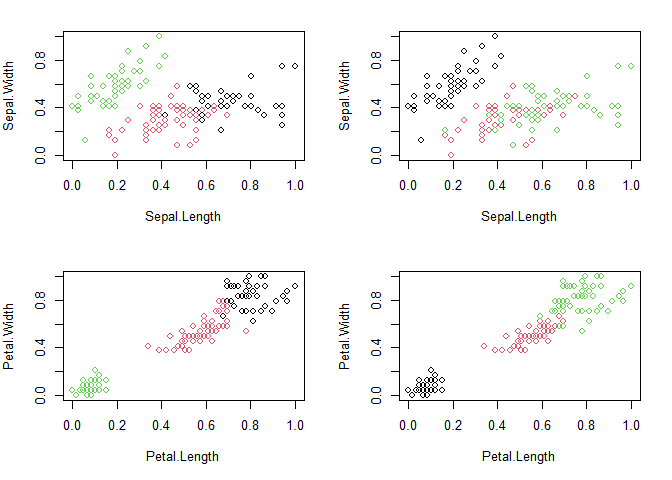
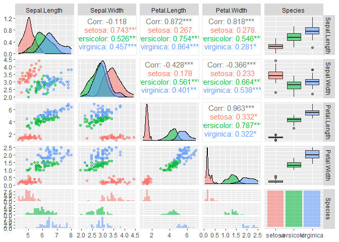
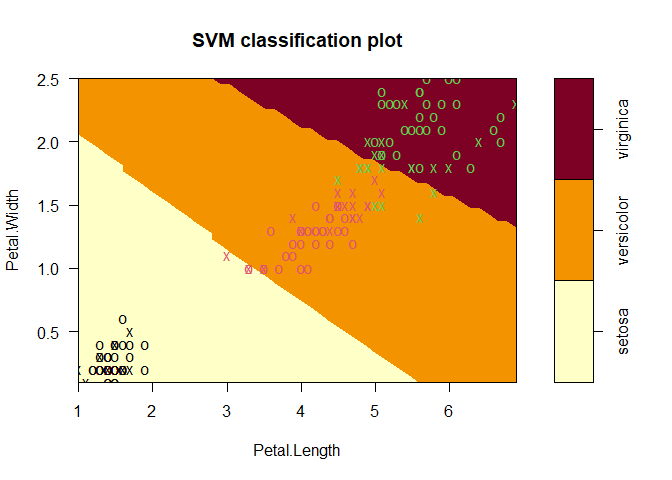
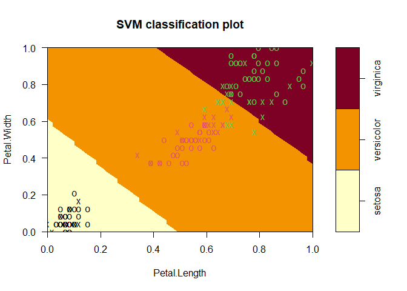

Week6
================
Xu Han
2023-08-13

## C50 Accuracy: 93.3%

## Kmean cluster Accuracy: 88.7%

## SVM accuracy:97.3%

\#The C5.0 algorithm \#First install these packages

``` r
library(dplyr)
```

    ## Warning: package 'dplyr' was built under R version 4.1.3

    ## 
    ## Attaching package: 'dplyr'

    ## The following objects are masked from 'package:stats':
    ## 
    ##     filter, lag

    ## The following objects are masked from 'package:base':
    ## 
    ##     intersect, setdiff, setequal, union

\#get the iris dataset (for more info
<https://en.wikipedia.org/wiki/Iris_flower_data_set>)

``` r
iris
```

    ##     Sepal.Length Sepal.Width Petal.Length Petal.Width    Species
    ## 1            5.1         3.5          1.4         0.2     setosa
    ## 2            4.9         3.0          1.4         0.2     setosa
    ## 3            4.7         3.2          1.3         0.2     setosa
    ## 4            4.6         3.1          1.5         0.2     setosa
    ## 5            5.0         3.6          1.4         0.2     setosa
    ## 6            5.4         3.9          1.7         0.4     setosa
    ## 7            4.6         3.4          1.4         0.3     setosa
    ## 8            5.0         3.4          1.5         0.2     setosa
    ## 9            4.4         2.9          1.4         0.2     setosa
    ## 10           4.9         3.1          1.5         0.1     setosa
    ## 11           5.4         3.7          1.5         0.2     setosa
    ## 12           4.8         3.4          1.6         0.2     setosa
    ## 13           4.8         3.0          1.4         0.1     setosa
    ## 14           4.3         3.0          1.1         0.1     setosa
    ## 15           5.8         4.0          1.2         0.2     setosa
    ## 16           5.7         4.4          1.5         0.4     setosa
    ## 17           5.4         3.9          1.3         0.4     setosa
    ## 18           5.1         3.5          1.4         0.3     setosa
    ## 19           5.7         3.8          1.7         0.3     setosa
    ## 20           5.1         3.8          1.5         0.3     setosa
    ## 21           5.4         3.4          1.7         0.2     setosa
    ## 22           5.1         3.7          1.5         0.4     setosa
    ## 23           4.6         3.6          1.0         0.2     setosa
    ## 24           5.1         3.3          1.7         0.5     setosa
    ## 25           4.8         3.4          1.9         0.2     setosa
    ## 26           5.0         3.0          1.6         0.2     setosa
    ## 27           5.0         3.4          1.6         0.4     setosa
    ## 28           5.2         3.5          1.5         0.2     setosa
    ## 29           5.2         3.4          1.4         0.2     setosa
    ## 30           4.7         3.2          1.6         0.2     setosa
    ## 31           4.8         3.1          1.6         0.2     setosa
    ## 32           5.4         3.4          1.5         0.4     setosa
    ## 33           5.2         4.1          1.5         0.1     setosa
    ## 34           5.5         4.2          1.4         0.2     setosa
    ## 35           4.9         3.1          1.5         0.2     setosa
    ## 36           5.0         3.2          1.2         0.2     setosa
    ## 37           5.5         3.5          1.3         0.2     setosa
    ## 38           4.9         3.6          1.4         0.1     setosa
    ## 39           4.4         3.0          1.3         0.2     setosa
    ## 40           5.1         3.4          1.5         0.2     setosa
    ## 41           5.0         3.5          1.3         0.3     setosa
    ## 42           4.5         2.3          1.3         0.3     setosa
    ## 43           4.4         3.2          1.3         0.2     setosa
    ## 44           5.0         3.5          1.6         0.6     setosa
    ## 45           5.1         3.8          1.9         0.4     setosa
    ## 46           4.8         3.0          1.4         0.3     setosa
    ## 47           5.1         3.8          1.6         0.2     setosa
    ## 48           4.6         3.2          1.4         0.2     setosa
    ## 49           5.3         3.7          1.5         0.2     setosa
    ## 50           5.0         3.3          1.4         0.2     setosa
    ## 51           7.0         3.2          4.7         1.4 versicolor
    ## 52           6.4         3.2          4.5         1.5 versicolor
    ## 53           6.9         3.1          4.9         1.5 versicolor
    ## 54           5.5         2.3          4.0         1.3 versicolor
    ## 55           6.5         2.8          4.6         1.5 versicolor
    ## 56           5.7         2.8          4.5         1.3 versicolor
    ## 57           6.3         3.3          4.7         1.6 versicolor
    ## 58           4.9         2.4          3.3         1.0 versicolor
    ## 59           6.6         2.9          4.6         1.3 versicolor
    ## 60           5.2         2.7          3.9         1.4 versicolor
    ## 61           5.0         2.0          3.5         1.0 versicolor
    ## 62           5.9         3.0          4.2         1.5 versicolor
    ## 63           6.0         2.2          4.0         1.0 versicolor
    ## 64           6.1         2.9          4.7         1.4 versicolor
    ## 65           5.6         2.9          3.6         1.3 versicolor
    ## 66           6.7         3.1          4.4         1.4 versicolor
    ## 67           5.6         3.0          4.5         1.5 versicolor
    ## 68           5.8         2.7          4.1         1.0 versicolor
    ## 69           6.2         2.2          4.5         1.5 versicolor
    ## 70           5.6         2.5          3.9         1.1 versicolor
    ## 71           5.9         3.2          4.8         1.8 versicolor
    ## 72           6.1         2.8          4.0         1.3 versicolor
    ## 73           6.3         2.5          4.9         1.5 versicolor
    ## 74           6.1         2.8          4.7         1.2 versicolor
    ## 75           6.4         2.9          4.3         1.3 versicolor
    ## 76           6.6         3.0          4.4         1.4 versicolor
    ## 77           6.8         2.8          4.8         1.4 versicolor
    ## 78           6.7         3.0          5.0         1.7 versicolor
    ## 79           6.0         2.9          4.5         1.5 versicolor
    ## 80           5.7         2.6          3.5         1.0 versicolor
    ## 81           5.5         2.4          3.8         1.1 versicolor
    ## 82           5.5         2.4          3.7         1.0 versicolor
    ## 83           5.8         2.7          3.9         1.2 versicolor
    ## 84           6.0         2.7          5.1         1.6 versicolor
    ## 85           5.4         3.0          4.5         1.5 versicolor
    ## 86           6.0         3.4          4.5         1.6 versicolor
    ## 87           6.7         3.1          4.7         1.5 versicolor
    ## 88           6.3         2.3          4.4         1.3 versicolor
    ## 89           5.6         3.0          4.1         1.3 versicolor
    ## 90           5.5         2.5          4.0         1.3 versicolor
    ## 91           5.5         2.6          4.4         1.2 versicolor
    ## 92           6.1         3.0          4.6         1.4 versicolor
    ## 93           5.8         2.6          4.0         1.2 versicolor
    ## 94           5.0         2.3          3.3         1.0 versicolor
    ## 95           5.6         2.7          4.2         1.3 versicolor
    ## 96           5.7         3.0          4.2         1.2 versicolor
    ## 97           5.7         2.9          4.2         1.3 versicolor
    ## 98           6.2         2.9          4.3         1.3 versicolor
    ## 99           5.1         2.5          3.0         1.1 versicolor
    ## 100          5.7         2.8          4.1         1.3 versicolor
    ## 101          6.3         3.3          6.0         2.5  virginica
    ## 102          5.8         2.7          5.1         1.9  virginica
    ## 103          7.1         3.0          5.9         2.1  virginica
    ## 104          6.3         2.9          5.6         1.8  virginica
    ## 105          6.5         3.0          5.8         2.2  virginica
    ## 106          7.6         3.0          6.6         2.1  virginica
    ## 107          4.9         2.5          4.5         1.7  virginica
    ## 108          7.3         2.9          6.3         1.8  virginica
    ## 109          6.7         2.5          5.8         1.8  virginica
    ## 110          7.2         3.6          6.1         2.5  virginica
    ## 111          6.5         3.2          5.1         2.0  virginica
    ## 112          6.4         2.7          5.3         1.9  virginica
    ## 113          6.8         3.0          5.5         2.1  virginica
    ## 114          5.7         2.5          5.0         2.0  virginica
    ## 115          5.8         2.8          5.1         2.4  virginica
    ## 116          6.4         3.2          5.3         2.3  virginica
    ## 117          6.5         3.0          5.5         1.8  virginica
    ## 118          7.7         3.8          6.7         2.2  virginica
    ## 119          7.7         2.6          6.9         2.3  virginica
    ## 120          6.0         2.2          5.0         1.5  virginica
    ## 121          6.9         3.2          5.7         2.3  virginica
    ## 122          5.6         2.8          4.9         2.0  virginica
    ## 123          7.7         2.8          6.7         2.0  virginica
    ## 124          6.3         2.7          4.9         1.8  virginica
    ## 125          6.7         3.3          5.7         2.1  virginica
    ## 126          7.2         3.2          6.0         1.8  virginica
    ## 127          6.2         2.8          4.8         1.8  virginica
    ## 128          6.1         3.0          4.9         1.8  virginica
    ## 129          6.4         2.8          5.6         2.1  virginica
    ## 130          7.2         3.0          5.8         1.6  virginica
    ## 131          7.4         2.8          6.1         1.9  virginica
    ## 132          7.9         3.8          6.4         2.0  virginica
    ## 133          6.4         2.8          5.6         2.2  virginica
    ## 134          6.3         2.8          5.1         1.5  virginica
    ## 135          6.1         2.6          5.6         1.4  virginica
    ## 136          7.7         3.0          6.1         2.3  virginica
    ## 137          6.3         3.4          5.6         2.4  virginica
    ## 138          6.4         3.1          5.5         1.8  virginica
    ## 139          6.0         3.0          4.8         1.8  virginica
    ## 140          6.9         3.1          5.4         2.1  virginica
    ## 141          6.7         3.1          5.6         2.4  virginica
    ## 142          6.9         3.1          5.1         2.3  virginica
    ## 143          5.8         2.7          5.1         1.9  virginica
    ## 144          6.8         3.2          5.9         2.3  virginica
    ## 145          6.7         3.3          5.7         2.5  virginica
    ## 146          6.7         3.0          5.2         2.3  virginica
    ## 147          6.3         2.5          5.0         1.9  virginica
    ## 148          6.5         3.0          5.2         2.0  virginica
    ## 149          6.2         3.4          5.4         2.3  virginica
    ## 150          5.9         3.0          5.1         1.8  virginica

``` r
head(iris,4)
```

    ##   Sepal.Length Sepal.Width Petal.Length Petal.Width Species
    ## 1          5.1         3.5          1.4         0.2  setosa
    ## 2          4.9         3.0          1.4         0.2  setosa
    ## 3          4.7         3.2          1.3         0.2  setosa
    ## 4          4.6         3.1          1.5         0.2  setosa

``` r
dim(iris)
```

    ## [1] 150   5

\#we need to divide our data into training data and test data. \#C5.0 is
a classifier, so you’ll be teaching it how to classify the different
species of irises using the training data.

``` r
library(C50)
```

    ## Warning: package 'C50' was built under R version 4.1.3

\#Splitting data set into traing and testing. \#Splitting data based on
the species

``` r
iris_setosa <- iris[iris$Species == "setosa", ]
iris_versicolor <- iris[iris$Species == "versicolor",]
iris_virginica <- iris[iris$Species == "virginica",]
```

\#splitting data sequentially \*optional

``` r
iris_train <- rbind(iris_setosa[1:35,], iris_versicolor[1:35,], iris_virginica[1:35,])
iris_test <- rbind(iris_setosa[36:50,], iris_versicolor[36:50,], iris_virginica[36:50,])
```

\#spliting randomly \#install caret lib which is used to split the
dataset

``` r
library(caret)
```

    ## Warning: package 'caret' was built under R version 4.1.3

    ## Loading required package: ggplot2

    ## Warning: package 'ggplot2' was built under R version 4.1.3

    ## Loading required package: lattice

``` r
library(tidymodels)
```

    ## -- Attaching packages -------------------------------------- tidymodels 1.1.0 --

    ## v broom        1.0.5     v rsample      1.1.1
    ## v dials        1.2.0     v tibble       3.2.1
    ## v infer        1.0.4     v tidyr        1.3.0
    ## v modeldata    1.1.0     v tune         1.1.1
    ## v parsnip      1.1.0     v workflows    1.1.3
    ## v purrr        1.0.1     v workflowsets 1.0.1
    ## v recipes      1.0.7     v yardstick    1.2.0

    ## Warning: package 'dials' was built under R version 4.1.3

    ## Warning: package 'scales' was built under R version 4.1.3

    ## Warning: package 'infer' was built under R version 4.1.3

    ## Warning: package 'modeldata' was built under R version 4.1.3

    ## Warning: package 'parsnip' was built under R version 4.1.3

    ## Warning: package 'purrr' was built under R version 4.1.3

    ## Warning: package 'rsample' was built under R version 4.1.3

    ## Warning: package 'tibble' was built under R version 4.1.3

    ## Warning: package 'tidyr' was built under R version 4.1.3

    ## Warning: package 'tune' was built under R version 4.1.3

    ## Warning: package 'workflows' was built under R version 4.1.3

    ## Warning: package 'workflowsets' was built under R version 4.1.3

    ## -- Conflicts ----------------------------------------- tidymodels_conflicts() --
    ## x purrr::discard()         masks scales::discard()
    ## x dplyr::filter()          masks stats::filter()
    ## x dplyr::lag()             masks stats::lag()
    ## x purrr::lift()            masks caret::lift()
    ## x yardstick::precision()   masks caret::precision()
    ## x yardstick::recall()      masks caret::recall()
    ## x yardstick::sensitivity() masks caret::sensitivity()
    ## x yardstick::specificity() masks caret::specificity()
    ## x recipes::step()          masks stats::step()
    ## * Use suppressPackageStartupMessages() to eliminate package startup messages

``` r
library(lattice)
library(ggplot2)
```

``` r
attach(iris)
inTrainingData <- createDataPartition(y= Species, p=0.70, list = FALSE)
trainData <- iris[inTrainingData,]
testData <- iris[-inTrainingData,]
```

\#Build the model on the training data

``` r
dtModel <- C5.0(trainData[,-5], trainData$Species)
plot(dtModel)
```

<!-- -->

\#Checking accuracy of the training data model \#The predict() function
takes your model, the test data \#and one parameter that tells it to
guess the class \#(in this case, the model indicates species).

``` r
predict(dtModel, testData)
```

    ##  [1] setosa     setosa     setosa     setosa     setosa     setosa    
    ##  [7] setosa     setosa     setosa     setosa     setosa     setosa    
    ## [13] setosa     setosa     setosa     versicolor versicolor versicolor
    ## [19] versicolor versicolor versicolor versicolor versicolor virginica 
    ## [25] virginica  versicolor versicolor versicolor versicolor versicolor
    ## [31] virginica  virginica  virginica  virginica  virginica  virginica 
    ## [37] virginica  virginica  versicolor virginica  versicolor versicolor
    ## [43] virginica  virginica  virginica 
    ## Levels: setosa versicolor virginica

``` r
summary(testData)
```

    ##   Sepal.Length    Sepal.Width    Petal.Length    Petal.Width          Species  
    ##  Min.   :4.300   Min.   :2.00   Min.   :1.100   Min.   :0.100   setosa    :15  
    ##  1st Qu.:5.100   1st Qu.:2.80   1st Qu.:1.500   1st Qu.:0.200   versicolor:15  
    ##  Median :5.800   Median :3.00   Median :4.500   Median :1.400   virginica :15  
    ##  Mean   :5.822   Mean   :3.06   Mean   :3.731   Mean   :1.178                  
    ##  3rd Qu.:6.400   3rd Qu.:3.30   3rd Qu.:5.200   3rd Qu.:1.800                  
    ##  Max.   :7.700   Max.   :4.40   Max.   :6.700   Max.   :2.400

``` r
(testData$Species == predict(dtModel, testData))
```

    ##  [1]  TRUE  TRUE  TRUE  TRUE  TRUE  TRUE  TRUE  TRUE  TRUE  TRUE  TRUE  TRUE
    ## [13]  TRUE  TRUE  TRUE  TRUE  TRUE  TRUE  TRUE  TRUE  TRUE  TRUE  TRUE FALSE
    ## [25] FALSE  TRUE  TRUE  TRUE  TRUE  TRUE  TRUE  TRUE  TRUE  TRUE  TRUE  TRUE
    ## [37]  TRUE  TRUE FALSE  TRUE FALSE FALSE  TRUE  TRUE  TRUE

``` r
mean(testData$Species == predict(dtModel, testData))
```

    ## [1] 0.8888889

# Accuracy: 0.933

``` r
library(gmodels)
```

    ## Warning: package 'gmodels' was built under R version 4.1.3

``` r
CrossTable(testData$Species,predict(dtModel, testData))
```

    ## 
    ##  
    ##    Cell Contents
    ## |-------------------------|
    ## |                       N |
    ## | Chi-square contribution |
    ## |           N / Row Total |
    ## |           N / Col Total |
    ## |         N / Table Total |
    ## |-------------------------|
    ## 
    ##  
    ## Total Observations in Table:  45 
    ## 
    ##  
    ##                  | predict(dtModel, testData) 
    ## testData$Species |     setosa | versicolor |  virginica |  Row Total | 
    ## -----------------|------------|------------|------------|------------|
    ##           setosa |         15 |          0 |          0 |         15 | 
    ##                  |     20.000 |      5.333 |      4.667 |            | 
    ##                  |      1.000 |      0.000 |      0.000 |      0.333 | 
    ##                  |      1.000 |      0.000 |      0.000 |            | 
    ##                  |      0.333 |      0.000 |      0.000 |            | 
    ## -----------------|------------|------------|------------|------------|
    ##       versicolor |          0 |         13 |          2 |         15 | 
    ##                  |      5.000 |     11.021 |      1.524 |            | 
    ##                  |      0.000 |      0.867 |      0.133 |      0.333 | 
    ##                  |      0.000 |      0.812 |      0.143 |            | 
    ##                  |      0.000 |      0.289 |      0.044 |            | 
    ## -----------------|------------|------------|------------|------------|
    ##        virginica |          0 |          3 |         12 |         15 | 
    ##                  |      5.000 |      1.021 |     11.524 |            | 
    ##                  |      0.000 |      0.200 |      0.800 |      0.333 | 
    ##                  |      0.000 |      0.188 |      0.857 |            | 
    ##                  |      0.000 |      0.067 |      0.267 |            | 
    ## -----------------|------------|------------|------------|------------|
    ##     Column Total |         15 |         16 |         14 |         45 | 
    ##                  |      0.333 |      0.356 |      0.311 |            | 
    ## -----------------|------------|------------|------------|------------|
    ## 
    ## 

``` r
CrossTable(testData$Species == predict(dtModel, testData))
```

    ## 
    ##  
    ##    Cell Contents
    ## |-------------------------|
    ## |                       N |
    ## |         N / Table Total |
    ## |-------------------------|
    ## 
    ##  
    ## Total Observations in Table:  45 
    ## 
    ##  
    ##           |     FALSE |      TRUE | 
    ##           |-----------|-----------|
    ##           |         5 |        40 | 
    ##           |     0.111 |     0.889 | 
    ##           |-----------|-----------|
    ## 
    ## 
    ## 
    ## 

# K-Means Clustering

``` r
require("datasets")
data("iris") # load Iris Dataset
str(iris) #view structure of dataset
```

    ## 'data.frame':    150 obs. of  5 variables:
    ##  $ Sepal.Length: num  5.1 4.9 4.7 4.6 5 5.4 4.6 5 4.4 4.9 ...
    ##  $ Sepal.Width : num  3.5 3 3.2 3.1 3.6 3.9 3.4 3.4 2.9 3.1 ...
    ##  $ Petal.Length: num  1.4 1.4 1.3 1.5 1.4 1.7 1.4 1.5 1.4 1.5 ...
    ##  $ Petal.Width : num  0.2 0.2 0.2 0.2 0.2 0.4 0.3 0.2 0.2 0.1 ...
    ##  $ Species     : Factor w/ 3 levels "setosa","versicolor",..: 1 1 1 1 1 1 1 1 1 1 ...

``` r
summary(iris) #view statistical summary of dataset
```

    ##   Sepal.Length    Sepal.Width     Petal.Length    Petal.Width   
    ##  Min.   :4.300   Min.   :2.000   Min.   :1.000   Min.   :0.100  
    ##  1st Qu.:5.100   1st Qu.:2.800   1st Qu.:1.600   1st Qu.:0.300  
    ##  Median :5.800   Median :3.000   Median :4.350   Median :1.300  
    ##  Mean   :5.843   Mean   :3.057   Mean   :3.758   Mean   :1.199  
    ##  3rd Qu.:6.400   3rd Qu.:3.300   3rd Qu.:5.100   3rd Qu.:1.800  
    ##  Max.   :7.900   Max.   :4.400   Max.   :6.900   Max.   :2.500  
    ##        Species  
    ##  setosa    :50  
    ##  versicolor:50  
    ##  virginica :50  
    ##                 
    ##                 
    ## 

``` r
head(iris, 3) #view top  rows of dataset
```

    ##   Sepal.Length Sepal.Width Petal.Length Petal.Width Species
    ## 1          5.1         3.5          1.4         0.2  setosa
    ## 2          4.9         3.0          1.4         0.2  setosa
    ## 3          4.7         3.2          1.3         0.2  setosa

\#Preprocess the dataset \#Since clustering is a type of Unsupervised
Learning, \#we would not require Class Label(output) during execution of
our algorithm. \#We will, therefore, remove Class Attribute
“Species” and store it in another variable. \#We would then
normalize the attributes between 0 and 1 using our own function.

``` r
iris.new<- iris[,c(1,2,3,4)]
iris.class<- iris[,"Species"]
head(iris.new, 3)
```

    ##   Sepal.Length Sepal.Width Petal.Length Petal.Width
    ## 1          5.1         3.5          1.4         0.2
    ## 2          4.9         3.0          1.4         0.2
    ## 3          4.7         3.2          1.3         0.2

``` r
head(iris.class, 3)
```

    ## [1] setosa setosa setosa
    ## Levels: setosa versicolor virginica

``` r
normalize <- function(x){
  return ((x-min(x))/(max(x)-min(x)))
}

iris.new$Sepal.Length<- normalize(iris.new$Sepal.Length)
iris.new$Sepal.Width<- normalize(iris.new$Sepal.Width)
iris.new$Petal.Length<- normalize(iris.new$Petal.Length)
iris.new$Petal.Width<- normalize(iris.new$Petal.Width)
head(iris.new)
```

    ##   Sepal.Length Sepal.Width Petal.Length Petal.Width
    ## 1   0.22222222   0.6250000   0.06779661  0.04166667
    ## 2   0.16666667   0.4166667   0.06779661  0.04166667
    ## 3   0.11111111   0.5000000   0.05084746  0.04166667
    ## 4   0.08333333   0.4583333   0.08474576  0.04166667
    ## 5   0.19444444   0.6666667   0.06779661  0.04166667
    ## 6   0.30555556   0.7916667   0.11864407  0.12500000

\#Apply the K-means clustering algorithm

``` r
result<- kmeans(iris.new,3) #aplly k-means algorithm with no. of centroids(k)=3
result$size # gives no. of records in each cluster
```

    ## [1] 39 61 50

``` r
result$centers # gives value of cluster center datapoint value(3 centers for k=3)
```

    ##   Sepal.Length Sepal.Width Petal.Length Petal.Width
    ## 1    0.7072650   0.4508547   0.79704476  0.82478632
    ## 2    0.4412568   0.3073770   0.57571548  0.54918033
    ## 3    0.1961111   0.5950000   0.07830508  0.06083333

``` r
result$cluster #gives cluster vector showing the custer where each record falls
```

    ##   [1] 3 3 3 3 3 3 3 3 3 3 3 3 3 3 3 3 3 3 3 3 3 3 3 3 3 3 3 3 3 3 3 3 3 3 3 3 3
    ##  [38] 3 3 3 3 3 3 3 3 3 3 3 3 3 1 2 1 2 2 2 2 2 2 2 2 2 2 2 2 2 2 2 2 2 2 2 2 2
    ##  [75] 2 2 2 1 2 2 2 2 2 2 2 2 2 2 2 2 2 2 2 2 2 2 2 2 2 2 1 2 1 1 1 1 2 1 1 1 1
    ## [112] 1 1 2 1 1 1 1 1 2 1 2 1 2 1 1 2 2 1 1 1 1 1 2 2 1 1 1 2 1 1 1 2 1 1 1 2 1
    ## [149] 1 2

\#Verify results of clustering

``` r
par(mfrow=c(2,2), mar=c(5,4,2,2))
plot(iris.new[c(1,2)], col=result$cluster)# Plot to see how Sepal.Length and Sepal.Width data points have been distributed in clusters
plot(iris.new[c(1,2)], col=iris.class)# Plot to see how Sepal.Length and Sepal.Width data points have been distributed originally as per "class" attribute in dataset
plot(iris.new[c(3,4)], col=result$cluster)# Plot to see how Petal.Length and Petal.Width data points have been distributed in clusters
plot(iris.new[c(3,4)], col=iris.class)
```

<!-- -->

``` r
table(result$cluster,iris.class)
```

    ##    iris.class
    ##     setosa versicolor virginica
    ##   1      0          3        36
    ##   2      0         47        14
    ##   3     50          0         0

\#How did the model do? \#TASK: Accuracy = number of correctly
classified/(total classified) = ? \#i.e our model has achieved ?%
accuracy!

``` r
CrossTable(result$cluster,iris.class)
```

    ## 
    ##  
    ##    Cell Contents
    ## |-------------------------|
    ## |                       N |
    ## | Chi-square contribution |
    ## |           N / Row Total |
    ## |           N / Col Total |
    ## |         N / Table Total |
    ## |-------------------------|
    ## 
    ##  
    ## Total Observations in Table:  150 
    ## 
    ##  
    ##                | iris.class 
    ## result$cluster |     setosa | versicolor |  virginica |  Row Total | 
    ## ---------------|------------|------------|------------|------------|
    ##              1 |          0 |          3 |         36 |         39 | 
    ##                |     13.000 |      7.692 |     40.692 |            | 
    ##                |      0.000 |      0.077 |      0.923 |      0.260 | 
    ##                |      0.000 |      0.060 |      0.720 |            | 
    ##                |      0.000 |      0.020 |      0.240 |            | 
    ## ---------------|------------|------------|------------|------------|
    ##              2 |          0 |         47 |         14 |         61 | 
    ##                |     20.333 |     34.973 |      1.973 |            | 
    ##                |      0.000 |      0.770 |      0.230 |      0.407 | 
    ##                |      0.000 |      0.940 |      0.280 |            | 
    ##                |      0.000 |      0.313 |      0.093 |            | 
    ## ---------------|------------|------------|------------|------------|
    ##              3 |         50 |          0 |          0 |         50 | 
    ##                |     66.667 |     16.667 |     16.667 |            | 
    ##                |      1.000 |      0.000 |      0.000 |      0.333 | 
    ##                |      1.000 |      0.000 |      0.000 |            | 
    ##                |      0.333 |      0.000 |      0.000 |            | 
    ## ---------------|------------|------------|------------|------------|
    ##   Column Total |         50 |         50 |         50 |        150 | 
    ##                |      0.333 |      0.333 |      0.333 |            | 
    ## ---------------|------------|------------|------------|------------|
    ## 
    ## 

``` r
iris$cluster=result$cluster
for (i in 1:length(iris$cluster)){
  if (iris$cluster[i] == 1){
    iris$label[i] = "virginica"
  } else if (iris$cluster[i] == 2){
    iris$label[i] = "versicolor"
  } else {
    iris$label[i] = "setosa"
  }
}
```

``` r
head(iris,3)
```

    ##   Sepal.Length Sepal.Width Petal.Length Petal.Width Species cluster  label
    ## 1          5.1         3.5          1.4         0.2  setosa       3 setosa
    ## 2          4.9         3.0          1.4         0.2  setosa       3 setosa
    ## 3          4.7         3.2          1.3         0.2  setosa       3 setosa

# prediction accuracy: 0.887

``` r
sum(iris$Species==iris$label)/nrow(iris)
```

    ## [1] 0.8866667

# Support vector machine

\#e1071 will be used for Support Vector Classification.

``` r
library(e1071)
```

    ## Warning: package 'e1071' was built under R version 4.1.3

    ## 
    ## Attaching package: 'e1071'

    ## The following object is masked from 'package:tune':
    ## 
    ##     tune

    ## The following object is masked from 'package:rsample':
    ## 
    ##     permutations

    ## The following object is masked from 'package:parsnip':
    ## 
    ##     tune

``` r
library(GGally)
```

    ## Warning: package 'GGally' was built under R version 4.1.3

    ## Registered S3 method overwritten by 'GGally':
    ##   method from   
    ##   +.gg   ggplot2

``` r
library(ggplot2)
```

\#get the dataset

``` r
data(iris)
```

\#explore the data

``` r
str(iris)
```

    ## 'data.frame':    150 obs. of  5 variables:
    ##  $ Sepal.Length: num  5.1 4.9 4.7 4.6 5 5.4 4.6 5 4.4 4.9 ...
    ##  $ Sepal.Width : num  3.5 3 3.2 3.1 3.6 3.9 3.4 3.4 2.9 3.1 ...
    ##  $ Petal.Length: num  1.4 1.4 1.3 1.5 1.4 1.7 1.4 1.5 1.4 1.5 ...
    ##  $ Petal.Width : num  0.2 0.2 0.2 0.2 0.2 0.4 0.3 0.2 0.2 0.1 ...
    ##  $ Species     : Factor w/ 3 levels "setosa","versicolor",..: 1 1 1 1 1 1 1 1 1 1 ...

``` r
head(iris,3)
```

    ##   Sepal.Length Sepal.Width Petal.Length Petal.Width Species
    ## 1          5.1         3.5          1.4         0.2  setosa
    ## 2          4.9         3.0          1.4         0.2  setosa
    ## 3          4.7         3.2          1.3         0.2  setosa

\#Create the SVM model

``` r
svm_model <- svm(Species ~ ., data=iris,
                 kernel="radial") #linear/polynomial/sigmoid
```

\#Lets have a closer look at the parameters \#and judge before hand if a
good model can be created or not.

``` r
ggpairs(iris, ggplot2::aes(colour = Species, alpha = 0.4))
```

    ## `stat_bin()` using `bins = 30`. Pick better value with `binwidth`.
    ## `stat_bin()` using `bins = 30`. Pick better value with `binwidth`.
    ## `stat_bin()` using `bins = 30`. Pick better value with `binwidth`.
    ## `stat_bin()` using `bins = 30`. Pick better value with `binwidth`.

<!-- -->

\#We can clearly see from the Histograms of Petal.length \#and
Petal.width that we can clearly seperate out Setosa species with very
high confidence.

\#However, Versicolor and Virginica Species are overlapped. \#If we look
at the scatterplot of Sepal.Length vs Petal.Length \#and Petal.Width vs
Petal.Length, \#we can distintly see a seperator that can be draw
between the groups of Species.

\#Looks like we can just use Petal.Width and Petal.Length as parameters
\#and come with a good model. SVM seems to be a very good model for this
type of data.

``` r
plot(svm_model, data=iris,
     Petal.Width~Petal.Length,
     slice = list(Sepal.Width=3, Sepal.Length=4) 
)
```

<!-- -->

\#from the graph you can see data, support vector(represented by cross
sign) \#and decision boundry, belong to 3 types of species

\#White color represented predicted class for second species(versicolor)

\#Pink color represented predicted class for third species(virginica)

\#Also we have 52 Support vector, \#8 of them belongs to first species
\#(You can see 8 cross in first class), \#22 of them belongs to second
species, \#21 of them belongs to third species.

\#Predict each Species \#Confusion matrix and missclassification error

``` r
pred = predict(svm_model,iris)
tab = table(Predicted=pred, Actual = iris$Species)
```

\#Get missclassification rate

``` r
1-sum(diag(tab)/sum(tab))
```

    ## [1] 0.02666667

# Does data normalization improve the prediction accuracy

``` r
summary(iris)
```

    ##   Sepal.Length    Sepal.Width     Petal.Length    Petal.Width   
    ##  Min.   :4.300   Min.   :2.000   Min.   :1.000   Min.   :0.100  
    ##  1st Qu.:5.100   1st Qu.:2.800   1st Qu.:1.600   1st Qu.:0.300  
    ##  Median :5.800   Median :3.000   Median :4.350   Median :1.300  
    ##  Mean   :5.843   Mean   :3.057   Mean   :3.758   Mean   :1.199  
    ##  3rd Qu.:6.400   3rd Qu.:3.300   3rd Qu.:5.100   3rd Qu.:1.800  
    ##  Max.   :7.900   Max.   :4.400   Max.   :6.900   Max.   :2.500  
    ##        Species  
    ##  setosa    :50  
    ##  versicolor:50  
    ##  virginica :50  
    ##                 
    ##                 
    ## 

``` r
svm_model2 <- svm(Species ~ ., data=iris.new,
                 kernel="radial")
```

``` r
plot(svm_model2, data=iris.new,
     Petal.Width~Petal.Length,
     slice = list(Sepal.Width=0.7, Sepal.Length=0.7) 
)
```

<!-- -->

``` r
pred2 = predict(svm_model2,iris.new)
tab2 = table(Predicted=pred2, Actual = iris$Species)
```

``` r
tab2
```

    ##             Actual
    ## Predicted    setosa versicolor virginica
    ##   setosa         50          0         0
    ##   versicolor      0         48         2
    ##   virginica       0          2        48

``` r
1-sum(diag(tab2)/sum(tab2))
```

    ## [1] 0.02666667

# Accuracy is 0.9733

``` r
sum(diag(tab2)/sum(tab2))
```

    ## [1] 0.9733333
